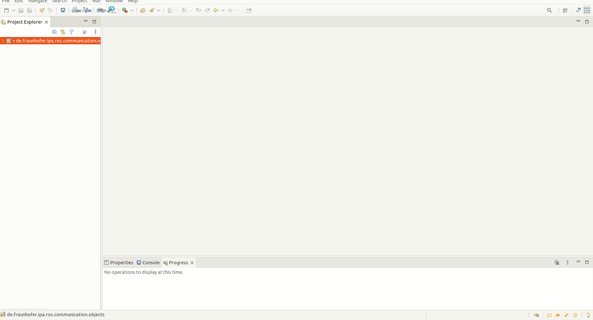
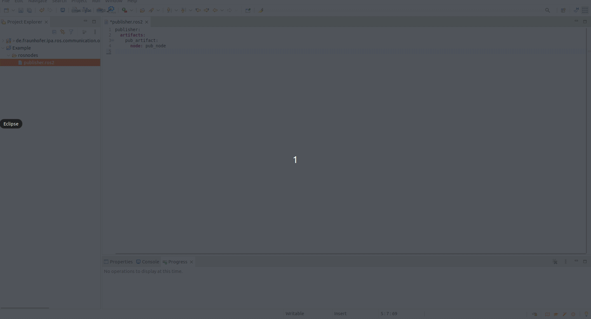
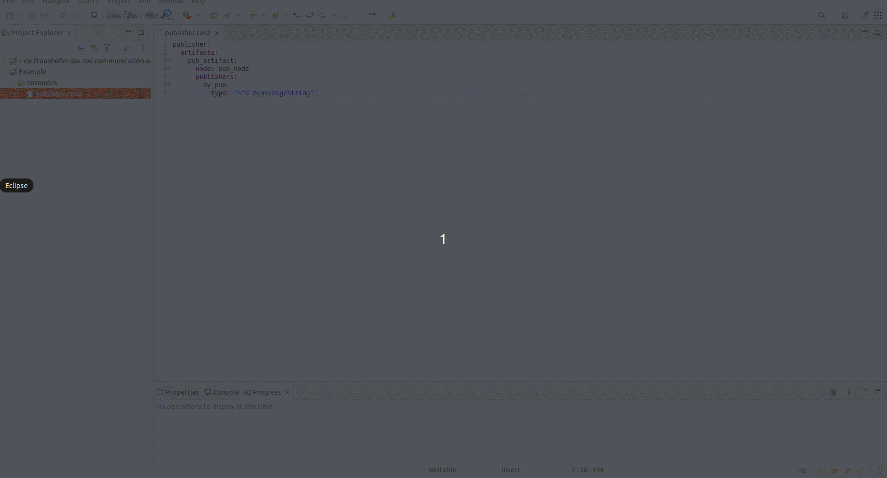
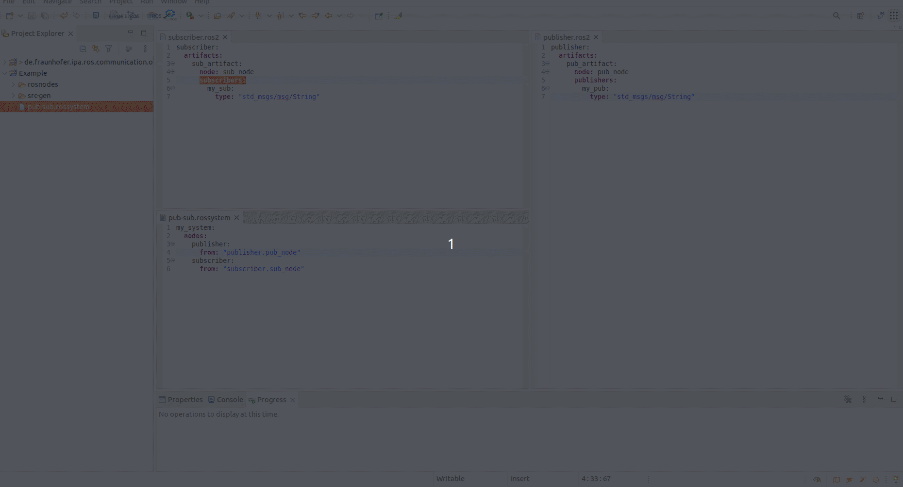
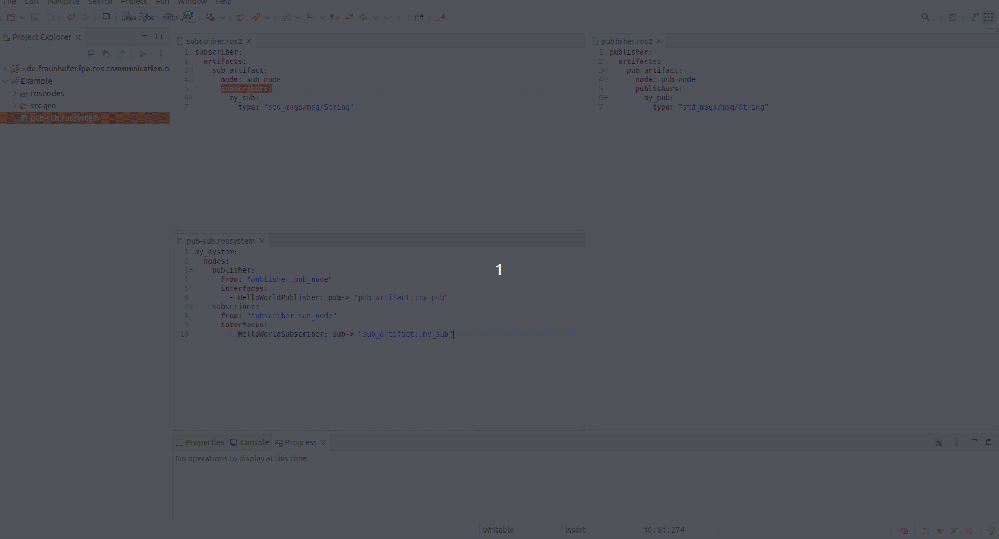

# Tutorial: How to create a simple Publisher-Subscriber example.
In this tutorial, we just want to show how the models can be used to define ROS nodes. For this, we will see how two simple nodes can be defined, one that acts as a publisher of a "Hello World!" message and another that receives it as a subscriber.

This tutorial is fictitious, it is not based on any existing ROS node. The ROS example is reflected in the models of the example [pub_sub_ros2](https://github.com/ipa-nhg/ros-model-examples/tree/main/pub_sub_ros2).

The first step is to create a project to hold the models.

To import this as a project in the RosTooling you can create a new modeling project. By File -> New -> Project -> General -> Project. Then you must give a name to the project, for example "Example" press next, and add as project reference "de.fraunhofer.ipa.ros.communication.objects". We recommend creating a folder called "rosnodes" within the project.



Once the project is created, you can create a new file my File -> New -> Other -> File. The file shall be created under the folder "rosnodes" and it must have the extension ".ros2", for example **publisher.ros2**. By creating a file type .ros2, Eclipse will convert the project to a Xtext project. Then copy the previous content to the new file.


Following the format of the [Ros model](RosModelDescription.md) we can now create a new Ros package, that contains a node with a publisher.

The first line of the model must contain the name of the package, as part of the grammar of the model ":" will close the name definition line:

```
publisher_package:

```

Then we need the artifact, a runnable to execute the node. As every YAML format file, we have to add indentation to the second line. Then pressing the keys "Ctrl"+Space bar the menu will suggest as an option the text "artifacts:". We select it and go to the next line. 

In the third line we must add a double indentation, we will create an object under artifacts. The next object will be a name for the artifact, for example, "pub_artifact":

```
publisher:
  artifacts:
    pub_artifact:
```

Similar to the artifact creation, we need to create a node, with the grammar "node: **NODENAME**":

```
publisher:
  artifacts:
    pub_artifact:
      node: pub_node
```
Now that we have the node, we can define the interfaces that offer this node as inputs and output to connect to it. In our case, we want to create a publisher, which is the type **String**** . 




The models will look similar to:

```
publisher:
  artifacts:
    pub_artifact:
      node: pub_node
      publishers:
        my_pub:
          type: "std_msgs/msg/String"
```

In the same way we can create a subscriber:



This new subscriber model will look like this:

```
subscriber:
  artifacts:
    sub_artifact:
      node: sub_node
      subscribers:
        my_sub:
          type: "std_msgs/msg/String"
```

Now that we have already the components we can compose them. For that, we have to create a new .rossystem file. Again go to File -> New -> Other -> File. The new file must have as extension .rossystem.

In [RosSystem description](RosSystemModelDescription.md) we explain the format of a system and the editor will support you to write the model properly.

The first that must be given is a name and then a ":" is required. In the next line, you must add indentation and you can press the keys "Ctrl" + Space bar for help. 
Then we will define the nodes that compose the system. Here under "from" we will link our previously created nodes, the grammar for the references is **PackageName.NodeName**.


So far our file looks like this:
```
my_system:
  nodes:
    publisher:
      from: "publisher.pub_node"
    subscriber:
      from: "subscriber.sub_node"
```

Now, we want to expose the ports to be connected. For that, we have to define the interfaces under the nodes. And again we have to reference the created interfaces, with the grammar **NodeName::InterfaceName**.



And the model is updated to:
```
my_system:
  nodes:
    publisher:
      from: "publisher.pub_node"
      interfaces:
        - HelloWorldPublisher: pub-> "pub_artifact::my_pub"
    subscriber:
      from: "subscriber.sub_node"
      interfaces:
        - HelloWorldSubscriber: sub-> "sub_artifact::my_sub"
```
The last step is to create a connection between the two components. For that, we will use the connections description, under the system description. The connections must be done between interfaces instances described within the models, otherwise, the model validator will give an error.



And the model is updated to:
```
my_system:
  nodes:
    publisher:
      from: "publisher.pub_node"
      interfaces:
        - HelloWorldPublisher: pub-> "pub_artifact::my_pub"
    subscriber:
      from: "subscriber.sub_node"
      interfaces:
        - HelloWorldSubscriber: sub-> "sub_artifact::my_sub"
  connections:
    -[ HelloWorldPublisher, HelloWorldSubscriber]
```

With this very basic example we hope you have understood how the models can be used and what kind of attributes they allow to represent.