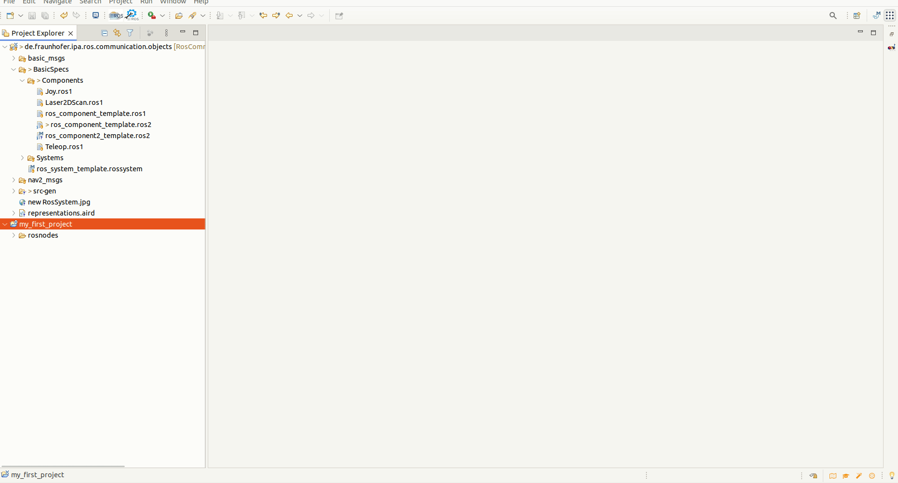
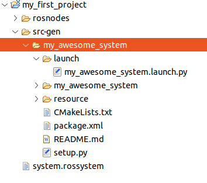
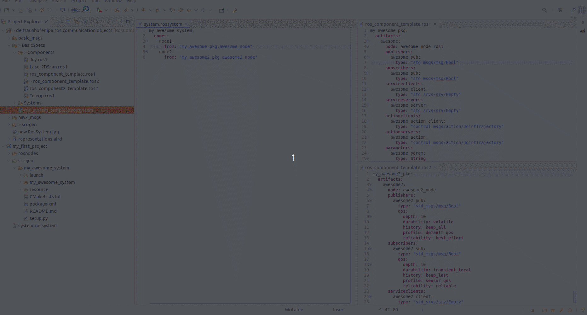
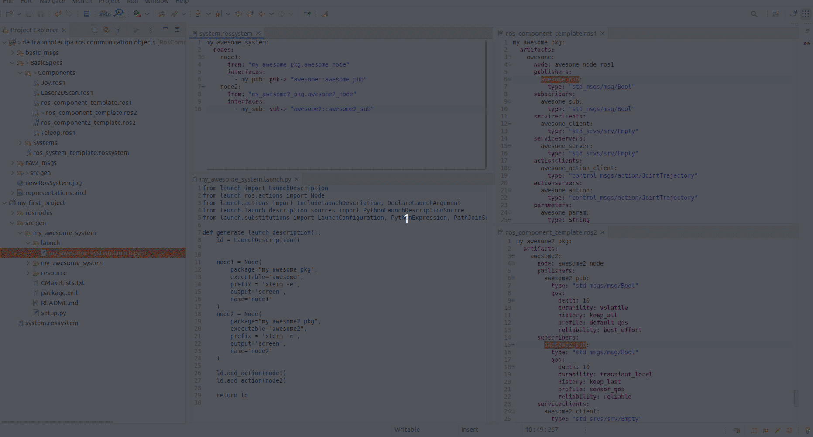
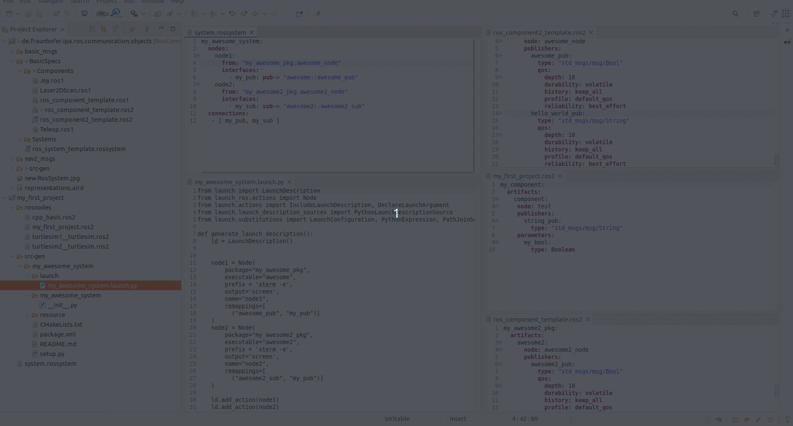

# Review models and the use of the textual editors for Ros Systems

To complete this tutorial the project "de.fraunhofer.ipa.ros.communication.objects" must be imported. See instructions under [setup](Environment_setup.md). If the automatic clone doesn't work for you, please clone the repository [RosCommonObjects](https://github.com/ipa320/RosCommonObjects) manually and import it to your Eclipse workspace.

The first step is to create a new Project to contain the examples, in case you completed the previous [tutorials](LearnRosModels.md) you can just use the same package. This can be done by pressing the icon "Add new ROS Project".


If the button doesn't work you can also create it manually using the Eclipse menu File -> New -> Other.. and searching for "Ros Model Project".


By default, a new project with a reference to the content of the "de.fraunhofer.ipa.ros.communication.objects" will be created. This new project contains a folder called "rosnodes" to hold the nodes description and a file with the extension .ros2 which will have an error because it is empty. The folder "rosnodes" can be removed for this example.

For this example, you can use existing .ros2 files for the composition. Under "de.fraunhofer.ipa.ros.communication.objects/BasicSpecs/Components" you can find the **ros_component_template.ros2** and the **ros_component2_template.ros2** files. Both represent fictitious nodes with all the possible interfaces and parameters. Please open both files and review the 

In [RosSystem description](RosSystemModelDescription.md) we explain the format of a system and the editor will support you to write the model properly.

The first that must be given is a name and then a ":" is required. In the next line, you must add indentation and you can press the keys "Ctrl" + Space bar for help. 
Then we will define the nodes that compose the system. Here under "from" we will link our previously created nodes, the grammar for the references is **PackageName.NodeName**.




So far our file looks like this:

```
my_awesome_system:
  nodes:
    node1:
      from: "my_awesome_pkg.awesome_node"
    node2:
      from: "my_awesome2_pkg.awesome2_node"
```

This model is basically creating a system composed of two nodes. While saving the model automatically a folder "src-gen" will be created. The folder contains a new ROS package whose structure corresponds to a launch file. 



The CMakeLists and package.xml list the required dependencies and tags to compile the package and the launch file starts both nodes. See the [Code generator review tutorial](docu/.....md) for further details.

Now, we want to expose the ports to be connected. For that, we have to define the interfaces under the nodes. And again we have to reference the created interfaces, with the grammar **NodeName::InterfaceName**. Although in ROS all the interfaces will be automatically exposed, the Rossystem model requires this step to clearly design the system and the ports that are intentionally opened by the architect of the system.



```
my_awesome_system:
  nodes:
    node1:
      from: "my_awesome_pkg.awesome_node"
      interfaces:
        - my_pub: pub-> "awesome::awesome_pub"
    node2:
      from: "my_awesome2_pkg.awesome2_node"
      interfaces:
        - my_sub: sub-> "awesome2::awesome2_sub"
```

The next step is to create a connection between the two components. For that, we will use the connections description, under the system description. The connections must be made between interface instances described within the models, otherwise, the model validator will give an error.




Currently, our model looks like this:

```
my_awesome_system:
  nodes:
    node1:
      from: "my_awesome_pkg.awesome_node"
      interfaces:
        - my_pub: pub-> "awesome::awesome_pub"
    node2:
      from: "my_awesome2_pkg.awesome2_node"
      interfaces:
        - my_sub: sub-> "awesome2::awesome2_sub"
  connections:
   - [ my_pub, my_sub ]
   ```

We invite you to try different combinations and debug the validator for connections. For example:

```
my_awesome_system:
  nodes:
    node1:
      from: "my_awesome_pkg.awesome_node"
      interfaces:
        - my_pub: pub-> "awesome::awesome_pub"
        - string_pub: pub-> "awesome::hello_world_pub"
    node2:
      from: "my_awesome2_pkg.awesome2_node"
      interfaces:
        - my_sub: sub-> "awesome2::awesome2_sub"
    
  connections:
   - [string_pub, my_sub]
```

This file will give a compilation error, and therefore the launch file will not be generated, because you are trying to connect ports with a different message type. The same will happen in case we try to connect different types of ports, like a topic with a service.

Also, another attribute that can be set and the generator will take into account is the namespace:



Lastly, we can check the set of parameter values. A valid example of this would be:

```
my_awesome_system:
  nodes:
    node1:
      from: "my_awesome_pkg.awesome_node"
      namespace: "my_ns"
      interfaces:
        - my_pub: pub-> "awesome::awesome_pub"
    node2:
      from: "my_awesome2_pkg.awesome2_node"
      interfaces:
        - my_sub: sub-> "awesome2::awesome2_sub"
      parameters:
        - string_example: "awesome2::awesome2_string_param"
          value: "hello"
  connections:
   - [ my_pub, my_sub ]
```


Where we give a string value to the parameter "awesome2_string_param". In case we try to give a wrong value, for example:

```
my_awesome_system:
  nodes:
    node1:
      from: "my_awesome_pkg.awesome_node"
      namespace: "my_ns"
      interfaces:
        - my_pub: pub-> "awesome::awesome_pub"
    node2:
      from: "my_awesome2_pkg.awesome2_node"
      interfaces:
        - my_sub: sub-> "awesome2::awesome2_sub"
      parameters:
        - string_example: "awesome2::awesome2_string_param"
          value: 5
  connections:
   - [ my_pub, my_sub ]
```

The compiler will give an error of mismatched type. 

Another feature included as part of the code generator is the generator of parameter files. This will be automatically done by the set of more than 5 parameters, for example for this example:

```
my_awesome_system:
  nodes:
    node1:
      from: "my_awesome_pkg.awesome_node"
      namespace: "my_ns"
      interfaces:
        - my_pub: pub-> "awesome::awesome_pub"
    node2:
      from: "my_awesome2_pkg.awesome2_node"
      interfaces:
        - my_sub: sub-> "awesome2::awesome2_sub"
      parameters:
        - array_example: "awesome::awesome_array_param"
          value: ["hello", "hallo"]
        - bool_example: "awesome::awesome_bool_param"
          value: true
        - double_example: "awesome::awesome_double_param"
          value: 1.2
        - integer_example : "awesome::awesome_integer_param"
          value: 2
        - string_param : "awesome::awesome_string_param"
          value: "hallo"
        - struct_param: "awesome::awesome_struct_param"
          value: [
            first: 2
            second: true]
  connections:
   - [ my_pub, my_sub ]
```

In this case, a new file will be created under "src-gen/PackageName/config/" and it will contain the configuration of the node2. The launch file will be adapted to launch the configuration from a file.

With this very basic example, we hope you have understood how the models can be used and what kind of attributes they allow to represent.