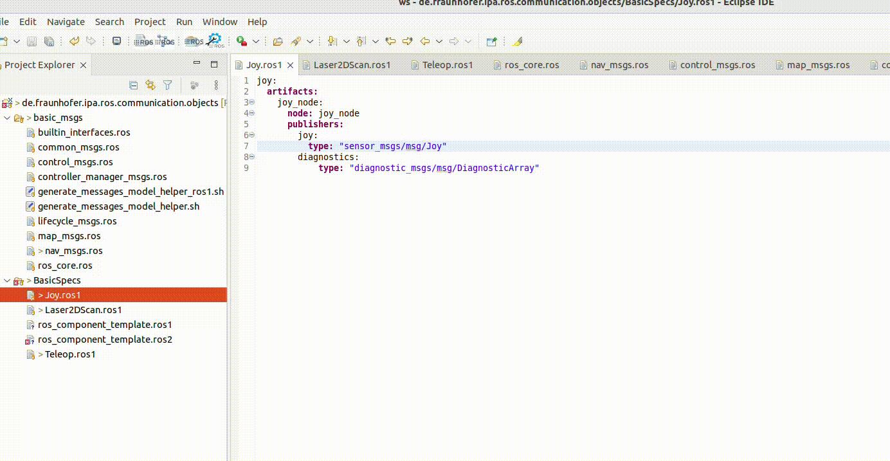
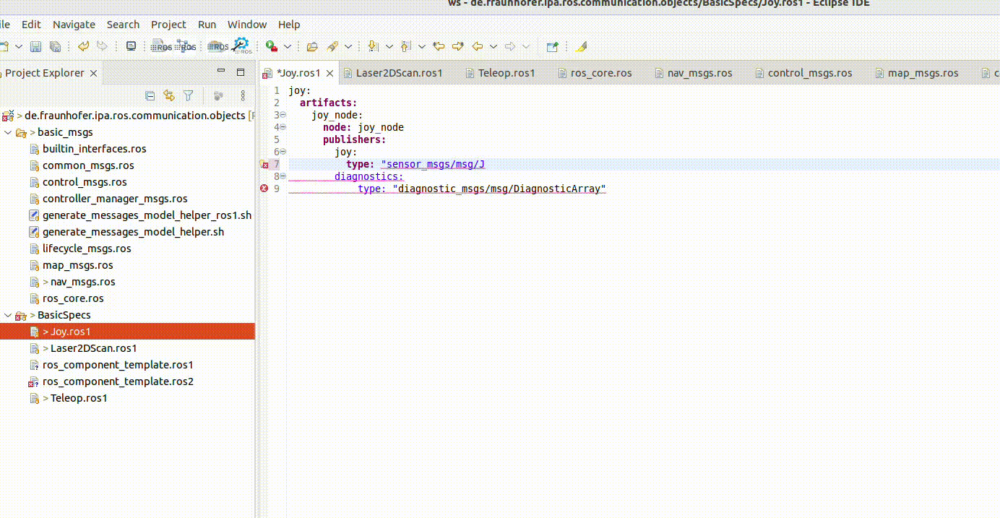

# HOW TO DESCRIBE ROS NODES USING THE LANGUAGE

Component models have two types of extensions, either .ros1 for ROS version 1 packages and .ros2 for ROS 2 packages. In both cases the language allows to describe package that contains ROS nodes and their interfaces.
To create a new model, you can easily just create a new file with the correct extension. For example my_node.ros2.

## ROS (1)

In ros1 the grammar is as follows:
```
my_awesome_pkg: #Name of the package
  **fromGitRepo: ** "http://github.com/MyAccount/RepoName:BranchName" # Optional, Git reopsitory path that contains the source code
  **artifacts:**
    awesome: # Name of the artifact (as it is named in the CMakeLists)
      **node:** awesome_node # Name of the node
      **publishers:** # (Optional) List of publishers 
        awesome_pub:
          **type:** "std_msgs/msg/Bool"
      **subscribers:** # (Optional) List of subscribers 
        awesome_sub:
          **type:** "std_msgs/msg/Bool"
      **serviceclients:** # (Optional) List of service clients 
        awesome_client:
          **type:** "std_srvs/srv/Empty"
      **serviceservers:** # (Optional) List of service servers 
        awesome_server:
          **type:** "std_srvs/srv/Empty"
      **actionclients:** # (Optional) List of action clients 
        awesome_action:
          **type:** "control_msgs/action/JointTrajectory"
      **actionservers:** # (Optional) List of action servers 
        awesome_action:
          **type:** "control_msgs/action/JointTrajectory"
      **parameters:** # (Optional) List of parameters
        awesome_param:
          **type:** String
          **default:** "Hello"
```


The format is based the YAML file format. All the words marked in the template with '**' are keywords that compose the model, they can't be modified. 


See the following model exmaple for the known teleop ROS package:

```
teleop:
  artifacts:
    teleop_twist_joy_node:
      node: teleop_twist_joy_node
      publishers:
        cmd_vel:
          type: "geometry_msgs/msg/Twist"
      subscribers:
        joy:
          type:"sensor_msgs/msg/Joy" 
```

## ROS 2

The ros2 grammar is as follows:
```
my_awesome_pkg:
  **fromGitRepo: ** "http://github.com/MyAccount/RepoName:BranchName"
  **artifacts:**
    awesome:
      **node:** awesome_node
      **publishers:**
        awesome_pub:
          **type:** "std_msgs/msg/Bool"
          **qos:** 
            **depth:** 10
            **durability:** volatile
            **history:** keep_all
            **profile:** default_qos
            **reliability:** best_effort 
      **subscribers:**
        awesome_sub:
          **type:** "std_msgs/msg/Bool"
          **qos:** 
            **depth:** 10
            **durability:** transient_local
            **history:** keep_last
            **profile:** sensor_qos
            **reliability:** reliable 
      **serviceclients:**
        awesome_client:
          **type:** "std_srvs/srv/Empty"
          **qos:** 
            **depth:** 10
            **durability:** volatile
            **history:** keep_all
            **profile:** services_qos
            **reliability:** best_effort 
      **serviceservers:**
        awesome_server:
          **type:** "std_srvs/srv/Empty"
          **qos:** 
            **depth:** 10
            **durability:** volatile
            **history:** keep_all
            **profile:** services_qos
            **reliability:** best_effort 
      **actionclients:**
        awesome_action:
          **type:** "control_msgs/action/JointTrajectory"
          **qos:** 
            **depth:** 10
            **durability:** volatile
            **history:** keep_all
            **profile:** default_qos
            **reliability:** best_effort 
      **actionservers:**
        awesome_action:
          **type:** "control_msgs/action/JointTrajectory"
          **qos:** 
            **depth:** 10
            **durability:** volatile
            **history:** keep_all
            **profile:** default_qos
            **reliability:** best_effort 
      **parameters:**
        awesome_param:
          **type:** String
          **default:** "Hello"
          **qos:** 
            **depth:** 10
            **durability:** volatile
            **history:** keep_all
            **profile:** parameter_qos
            **reliability:** best_effort 
```

The only remarkable difference with the ROS 1 model is that the quality of service can be defined for all the different interfaces. The quality of service atrributes are optional and they allow the following options:

- depth : it must be an integer.
- durability: volatile / transient_local
- history: keep_all / keep_last
- profile: default_qos / sensor_qos / services_qos/ parameter_qos
- reliability: best_effort / reliable

The type of supported parameters are:
- Boolean 
- Double
- String
- Integer
- Base64
- List [Type, Type]
- Array [Type]
- Struct [Name Type, Name Type]

For more details please check the following [examples](ParametersAPI.md).

See the following example for the [arucos_ros](https://github.com/pal-robotics/aruco_ros) driver:

```
aruco_ros:
  fromGitRepo: "https://github.com/pal-robotics/aruco_ros.git:humble-devel"
  artifacts:
    marker_publisher:
      node: marker_publisher
      subscribers:
        image_raw:
          type: "sensor_msgs/msg/Image"
      publishers:
        debug:
          type: "sensor_msgs/msg/Image"
        markers:
          type: "aruco_msgs/msg/MarkerArray"
        markers_list:
          type: "std_msgs/msg/UInt32MultiArray"
        result:
          type: "sensor_msgs/msg/Image"
      parameters:
        camera_frame:
          type: String
        image_is_rectified:
          type: Boolean
        marker_size:
          type: Double
        reference_frame:
          type: String
        raw_image_topic:
          type: String
        use_camera_info:
          type: Boolean
        use_sim_time:
          type: Boolean
        camera_info_topic:
          type: String
```

## Textual model editor

The textual editor contains checker embedded, for example:



It incorporates also the auto-complete function. This is available by pressing **Ctrl** + the space bar:


