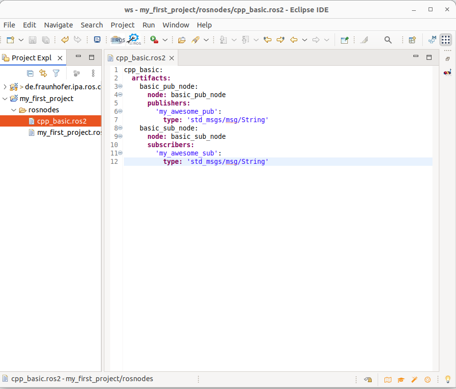

# Extract models using static code analysis

This tutorial requires [Docker](https://docs.docker.com/install/linux/docker-ce/ubuntu/) infrastructure. 

As the RosTooling leverages existing ROS code, one of the techniques to create models is to extract them from existing code. For this purpose, we created a plugin based on [HAROS](https://github.com/git-afsantos/haros) that generates automatically ROS models.

The code of the extractor is publicly available under [ros-model-extractors](https://github.com/ipa320/ros-model-extractors).

Imagine we want to use the extractors to analyze the following ROS 2 package that contains code for two simple ROS nodes: [cpp_basic_ros2](https://github.com/ipa-nhg/cpp_basic_ros2).

Following the instructions of the extractor repository, the commands to be run to build the Docker container are:

```
git clone https://github.com/ipa320/ros-model-extractors
cd ros-model-extractors
[sudo] docker build --tag=haros_humble -f docker/humble/Dockerfile .
```

Once it finishes, we can then call HAROS and the model generator. The command is:

```
[sudo] docker run -it haros_humble:latest /haros_runner.sh *package_name* *node_name* *type* *path_to_resulted_model* *workspace_path* "*github_repositoryA -b branch*" "*github_repositoryB*"...
```

For the case of the package we want to analyze it will be:
```
[sudo] docker run -it haros_humble:latest /haros_runner.sh cpp_basic --all node . /home/extractor/ws "https://github.com/ipa-nhg/cpp_basic_ros2"
```

The output of this command will be the content for the models corresponding to the artifacts found on the CMakeLists of the ROS2 package, in this case, **basic_pub_node** and **basic_sub_node**.

```
## Call the HAROS plugin to extract the ros-models ##
~~~~~~~~~~~
Extraction finished. See the following report:
INFO: Found artifact: basic_pub_node
INFO: Found artifact: basic_sub_node
~~~~~~~~~~~
###########
~~~~~~~~~~~
Print of the model: ./basic_pub_node.ros2:
~~~~~~~~~~~
cpp_basic:
  artifacts:
    basic_pub_node:
      node: basic_pub_node
      publishers:
        'my_awesome_pub':
          type: 'std_msgs/msg/String'

~~~~~~~~~~~
###########
~~~~~~~~~~~
Print of the model: ./basic_sub_node.ros2:
~~~~~~~~~~~
cpp_basic:
  artifacts:
    basic_sub_node:
      node: basic_sub_node
      subscribers:
        'my_awesome_sub':
          type: 'std_msgs/msg/String'

~~~~~~~~~~~
###########
```

If you copy the output in a .ros2 file on the RosTooling the models and their attributes will be parsed and interpreted. For simplification, both artifacts can also be merged into a single file.



Another nice example to test is the [aruco_ros](https://github.com/pal-robotics/aruco_ros) package, its corresponding command is:

```
[sudo] docker run -it haros_humble:latest /haros_runner.sh aruco_ros --all node . /home/extractor/ws "https://github.com/pal-robotics/aruco_ros"
```

This is a very basic example. The extraction technologies have a huge potential, unfortunately since the ROS 2 Humble distro the extractor works only for simple Cpp code. Unfortunately, some changes on the colcon build infrastructure and how it calls the clang compiler broke our extraction tools. 

We are looking for help and collaboration to fix the current issues we are facing. If you are interested please contact Nadia (mailto: [nhg@ipa.fhg.de](nhg@ipa.fhg.de)). THANKS!! :)
